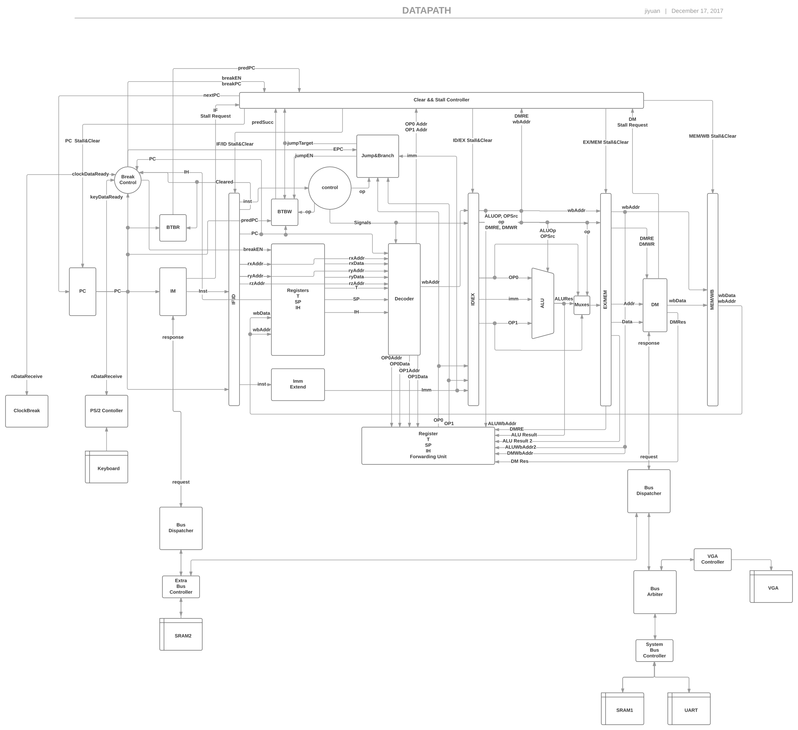

# THCO MIPS指令计算机 系统设计和实现

 林锦坤 杨国炜 朱佳豪小组 

[TOC]

## 实验环境

硬件环境：THINKPAD教学计算机。

软件环境：FPGA开发工具软件Xilinx ISE 14.7，串口调试精灵。

## 完成情况

-   使用流水完成了 CPU 的所有基本功能，在支持 25 条基本指令集以外，还支持了 ``SLTUI`` , ``MOVE``, ``SLT``, ``NEG`` , ``NOT``，这 5 条扩展指令集，以及一条硬件中断指令 `SW_RS`[^1] ， 总计 31 条指令。

    [^1]: 这条指令应该叫做 `eret`，但是在指令集中没有找到同名指令，故选了这样一条指令。

-   实现了 BTB 模块，使用更高效的分支预测替代了延迟槽

-   实现了基于键盘的硬件中断以及基于内部时钟的硬件中断

-   完成了扩展程序 FlappyBird (ThinPad ver.)，并进行了基于硬件的渲染优化，保证了画面运行的流畅性

-   支持 VGA 外接显示，用于扩展程序的可视化

-   支持键盘 PS/2 模块，用于扩展程序的操作

-   性能：最高可运行在 50MHz，可以通过所有测例，但是硬件中断功能无法正常使用。在 40MHz 下可以正常使用硬件中断功能。

## 硬件设计
采用五段流水设计，实现了分支预测，不支持延迟槽。存储上使用了两块SRAM，分别用于存储数据和指令，外设上支持读取键盘输入和显示VGA。

### 数据通路图

### 冲突的解决

1. 结构冲突

   对于寄存器的冲突，采用的方法是在下降沿写入，读则一直在读。

   对于IM和DM的冲突，IM和DM会向外发送一个读取总线数据的请求，马上就会收到一个回复（组合逻辑完成），表示是否争抢到总线的资源。如果没有争抢到，就会向StallClearController发送一个StallRequest，这样流水就会停止，等待下一个周期再继续争抢资源。

2. 数据冲突

   主要通过3个旁路解决，在ForwardUnit中处理。遇到必须停止流水的指令时，StallClearController会将 PC, IF_ID 停住，等待下一个流水周期。

   代码中有一种极端的数据冲突没有考虑：即下条指令的值被当前指令改写。此时应当也暂停流水。但是由于地址的划分，这种情况是不可能出现的，故没有考虑。

3. 控制冲突

   使用分支预测解决冲突。当预测出错时，会将读错的指令清空，具体是在下一个时钟周期给IF_ID清空，信号由StallClearController给出。

### uart读写

-   UART 读写测试
    在执行 LW 指令时，对特定内存地址 0xFF01(原设定是 0xBF01，本项目对该地址有改动) 的读取操作并非一般的 SRAM 读取，实际上是一种特殊的地址映射。该指令到达系统总线控制模块 SysBusController 时，该模块直接以 UART 读写信号寄存器的值作为这次访存结果，结果的意义同原设定。

-   UART 读操作

    也即读串口操作，对应指令为 LW 指令对特定内存地址 0xFF00 (原设定是 0xBF00，本项目对该地址有改动) 的读取。采用了异步的处理方式，由一个专门 UART 模块，负责接收来自串口的数据，具体操作为与板上自带的 CPLD 模块代码进行交互。一旦受到来自串口的数据，则将特定的串口读取信号寄存器拉到高电位，告知 CPU 串口数据可读。
    读取数据时候由于需要占用系统总线，故而让 SysBusController 模块对流水添加 Stall 以暂停 DM 模块之前的全部流水模块，待读操作占用总线部分完成以后放开流水。

-   UART 写操作

    也即写串口操作，对应指令为 SW 指令对特定内存地址 0xFF00 的写入。采用了同步的处理方式，也由同一个 UART 模块负责写串口，执行时添加 Stall 以暂停 DM 模块之前全部的流水模块。
    虽然按照书上要求，只有准备写入数据时候需要用到系统总线，在等待 i_tbre, i_tsre 信号期间并不用占用系统总线，理论上可以做到异步写；但是在我们的压力测试下，如果在以上两个期间我们使用系统总线进行内存读写操作，可能会有一定概率产生串口发送数据错误，所以我们最终采用了同步的方式，直到 i_tsre 信号置 1，才放开流水继续执行指令。

### sram读写

-   内存使用的特殊设计
    旨在减少上文提到的各种冲突，提高流水效率，我们利用了两块 SRAM 以及地址映射技术，分开存储程序和数据。
    对于 0x8000 之前的地址位，按照设定 0x4000 之前存储系统程序， 0x4000 之后存储用户程序，故而取指模块 IM 只会对这部分程序进行读取操作。这些程序被存入 RAM2 中，由 ExtBusController 管理，这解释了通路图中，不存在 IM 后的地址映射模块将指令映射到 SysBusController 的情况。
    对于 0x8000 之后的地址位，按照设定均为系统和用户数据区，这些数据被存入 RAM1 中，由 SysBusController 管理。
    由于只要流水在执行，IM 部分就会不断地对 ExtBusController 进行访存请求，所以要尽可能避免与 IM 模块的冲突。这样设计下，只有对用户程序区进行写入操作时会发生冲突，大大降低了加入气泡的概率。
-   SRAM 读操作
    对内存的读写操作也由 SysBusController 管理，这是由 RAM1 和串口共用了系统总线的硬件特性而决定的。内存读取操作并不复杂，设置完总线使能和读取地址后直接读取总线数据即可。由于是组合逻辑电路，只要等满建立时间，总线数据变化后，后续数据便会相应变化。但是读操作的建立时间非常长，是整个流水主频的瓶颈。
-   SRAM 写操作
    对内存的写入操作更加复杂一些。写入时先要准备好数据和地址，然后将 nWE 使能拉高，保持一段时间后 (根据文档应是 8ns)，拉低 nWE，此时数据写入 SRAM 中。由于使能需要跳变，所以在这一阶段使用 i_clock 作为敏感信号，在半周期时改变 nWE 的值。这样做虽然不是最高效的（可以引入一个更加高频的时钟来完美控制建立时间），但是由于瓶颈主要在于读操作，优化写操作的意义也就不大了。

### 高分辨率VGA的实现

由于我们需要做一个帧频和画质要求都较高的游戏，故需要在分辨率、VGA显存大小和运行时间之间做出权衡。最终我们实现了分辨率为240*160的彩色高分辨率VGA。

* 显存设计

  一般的显存设计包含两个部分，一个用于VGA读取，另一个用于缓存绘制的图片，这样可以避免错误的绘制被VGA读取而产生的画面闪烁效果，但是由于我们内存空间不足，只能放弃用于缓冲的显存。

  VGA支持RGB各8种颜色的显示，故每个像素的颜色信息共需要9位进行存储。因为9位连续存储读取和写入都十分不方便，又没有足够的空间能将其拓展为16位进行存储。故我们放弃了G的颜色存储位的一位，即绿色只有4种颜色，这样就能用8位存储下一个像素的颜色信息。

  这样我们的显存占用的空间为 $$\frac{240*160*8}{16}=19200$$ 个地址位，可以存放在一个SRAM中。

* 最高帧频

  我们计算一个像素平均所需要的MIPS语句大约为10条，可以得出在主频为25MHz[^2]的CPU

  [^2]: 由于设计上的缺陷，VGA时钟必须与主频时钟同步，即他们之间是倍数关系，且带有中断功能的CPU只能在40MHz下运行，因而在游戏过程中主频降频至原来一半。但即使如此也能够满足画面流畅的要求。

  下运行可以达到的最高帧频为$$\frac{25*10^6}{240*160*10}\approx65 ​$$fps，故可以满足流畅游戏的要求，我们最终设计的帧频为60fps。

### 硬件中断

实现了键盘中断和时钟中断。中断后PC会调到预先设置好的中断处理代码，处理完后再跳回原来的PC。具体如下：

中断到来，由BreakController向StallClearController发送中断使能和处理中断的PC，并存储流水第一或者第二阶段的PC，记为EPC，然后把流水前两个阶段的指令清空，并且置中断状态为1，表示不允许中断。中断处理完成后，使用一条特殊的指令，跳回到EPC，并把中断寄存器清0。

每次都把前两个阶段的指令清空，是由于跳转指令只会出现在前两个阶段，所以需要将其清空。跳回来的时候，正常是应当跳回第二阶段的PC，但是第二阶段的PC可能是分支预测出错清空的PC，所以这时候应当选择第一阶段的PC。

跳回的时候，不能马上将中断寄存器打开，否则如果跳回后马上中断，EPC记录的就是中断的最后一条指令了，这样会导致永远无法回到用户程序。所以需要等待至少一个流水周期后，才将中断开启。

跳回指令使用了一条不在我们要求的指令集里的指令 `SW_RS`。这样只是为了方便，否则需要重写Assemblerer。

### 分支预测

存储了有8个表项的BTB，每个表项为2个寄存器，分别存储了跳转指令的地址(key)和应当跳去的地址(val)。每次读到一条指令就查表，如果找到相同的key，就以val作为下一个PC，否则就以PC+1作为下一个PC。

如果当前指令是跳转指令，就需要将此指令和跳转目标存入表中。如果找得到key相同的表项，更新即可，否则就将最早的表项替换掉。

使用25M时钟测试测例时，每个测例都能够有1s的速度提升。

## 软件设计

我们设计了一个Flappy bird游戏，游戏中控制一个鸟的飞行，鸟在正常时候会进行自由落体。而每当按下一个按键，鸟就会向上跳跃。游戏中会不断出现随机高度的管道，鸟通过管道间的空隙就能加一分，碰到管道则会死亡，游戏结束。该游戏的具体设计如下。

* 游戏循环

  在游戏开始时进入开始界面，等待键盘按键，按下按键后进入游戏循环。游戏在每次循环中依次进行如下操作：参数更新、碰撞检测、画面绘制、事件处理。当碰撞检测发现鸟与柱子或地板产生了碰撞则进入结束界面。开始和结束界面如下图所示。

  

  ​

* 参数更新

  为了实现较为逼真的鸟的自由落体和跳跃效果，我们设计了一个物理引擎。其中参数包括鸟的高度、速度和重力加速度。由于我们的显示是离散的像素，并且鸟的高度每次移动不能超过一个像素（具体原因后面会说明）。所以我们采用了累计更新的方法，速度值为x表示每次更新时移动0.01*x个像素，也就是每次更新时将速度累加当累加值超过100时则进行更新，将鸟的位置加1或减1。

  对速度值的更新则是每次都增加一个定值，该定值即为重力加速度。而当鸟跳跃时则将速度值直接修改为一个向上的定值就可以产生跳跃的效果。

  除了鸟的更新，还有柱子的位置的更新，每次更新时将柱子位置减少1，当柱子移出屏幕左端则将其高度修改为随机值并将其位置移至最右端。关于随机数的生成，我们采用的是一种伪随机的方法，每次将一个随机数累加器加上一个固定质数，再取其后若干位（即为取模）作为随机数。

  地板位置的更新与柱子差不多这里不在赘述。

* 画面绘制

  * 透明处理

    为了方便存储我们的图片都是做成矩形进行存储，但是鸟后面的背景会实时变换，故不能保存。我们的处理方法是将黑色（RGB为(0,0,0)）设定为透明色（如下图所示），在绘制该颜色时去背景图中寻找对应的像素进行绘制。

    

  * 闪烁处理

    如上面章节“高分辨率VGA的实现”所述，由于内存不足的原因我们没有作为缓冲的显存，这也就导致了画面绘制时若是绘制了“错误”的画面就会出现闪烁的效果。这里错误是指，比如在绘制背景时将鸟所在的像素成了背景，若是VGA在这时进行了该位置的读取，就会在鸟所在位置显示出背景。

    为了避免这种闪烁，我们采取的方法是不进行背景的绘制，但是这样会有一个问题，就是移动后会因为没人将物体之前位置的像素擦除，从而留下残影。我们的解决方法就是透明处理的方法，在图片边框最少留下一个像素的“透明色”，用该颜色来绘制背景。这也就是为什么鸟每次移动距离不能超过1个像素的原因。

* 事件处理

  与软件相关的硬中断事件有两种，分别是时间中断和键盘中断。时间中断定时触发，游戏的帧频为60fps。故每过$$\frac1{60}s$$就会触发一次时间中断，而键盘按下任意键则会触发键盘中断事件。触发中断后CPU会在一固定地址记录该中断的类型。在事件处理阶段若是该地址没有事件，则会一直循环直到事件出现。

  若是出现了键盘中断事件则修改速度参数使其变为一个向上的定值，然后继续等待事件。若是出现了时间中断事件，则退出等待，进入下一个游戏循环。

* 内存地址划分

  内存空间不够导致我们不得不对内存进行十分精细的划分，其中大部分用于存储图片数据，具体划分如下表所示，可以看到SRAM1中的空间被我们使用得只剩下384个内存地址，利用率高达$$\frac{2^{15}-384}{2^{15}}\approx98.8\%$$。

  | 地址        | 存储内容                  |
  | :-------- | :-------------------- |
  | 0000~0FFF | code                  |
  | 1000~17FF | start       (128*32)  |
  | 1800~1BFF | game over   (128*16)  |
  | 1C00~1C7F | dead bird   (16*16)   |
  | 1C80~1CFF |                       |
  | 1D00~1FFF | break code            |
  | 2000~207F | bird1       (16*16)   |
  | 2080~20FF | bird2       (16*16)   |
  | 2100~217F | bird3       (16*16)   |
  | 2180~227F | pipe        (32*16)   |
  | 2280~2C7F | ground      (160*32)  |
  | 2C80~777F | background  (160*240) |
  | 7780~77FF | num0        (16*16)   |
  | 7800~787F | num1        (16*16)   |
  | 7880~78FF | num2        (16*16)   |
  | 7900~797F | num3        (16*16)   |
  | 7980~79FF | num4        (16*16)   |
  | 7A00~7A7F | num5        (16*16)   |
  | 7A80~7AFF | num6        (16*16)   |
  | 7B00~7B7F | num7        (16*16)   |
  | 7B80~7BFF | num8        (16*16)   |
  | 7C00~7C7F | num9        (16*16)   |
  | 7C80~7CFF | bird MEM    (16*16)   |
  | 7D00~7EFF | num MEM     (32*16)   |
  | 7F00~7FFF |                       |

## 分工

林锦坤：主要负责流水中与控制冲突相关的部分，以及中断的处理。实现的元件为：

- PC
- IF_ID
- JumpAndBranch
- ID_EX
- EX_MEM
- MEM_WB
- StallClearController
- BTB
- BreakController
- ClockBreak

朱佳豪：主要负责SRAM，UART和VGA的读写，以及一部分实现部分软件功能。实现的元件为：

- IM
- DM
- ExtBusController
- SystemBusController
- UART
- BusArbiter

杨国炜：主要负责流水控制冲突外元件的编写，以及实现主要的软件功能。实现的元件为：

- myRegister
- ImmExtend
- Control
- Decoder
- ForwardUnit
- ALU
- ALU_MUX

## 实用的工具与技巧

### 调试工具

1. Led灯输出阶段寄存器信息，以及重要的使能信号。
2. 采用click作为时钟，可以做到**单步调试**。
3. ISE内置一个**逻辑分析仪(ChipScope)**，能够设置采样时钟和要采样的信号，烧入板子后，设置采样的触发条件，触发成功后就可以在电脑上读出采得的数据。由于使用的是FPGA片内的资源，所以需要与工程一起编译。

### 时序优化

1. ISE的ip_core中提供了**DCM (digital clock management)**，其作用是精准的生成由输入时钟经过相移、分频等操作得到的时钟。我们可以利用此工具生成多种频率的时钟。当无法跑到50MHz，而可以跑25MHz的时候，可以生成25-50M之间的时钟，来测试最高主频。
2. ISE提供了**Timing Constraint**的功能，执行工具不会试图寻找达到最快速的布局&布线路径。——取而代之的是，执行工具会努力达到你所期望的性能要求。我们可以将所有的输出都加上Contraint，用于提高主频，但是编译时间可能会相应增长。
3. **删除无用的调试输出**，例如逻辑分析仪和led灯的输出。

### 其他
1. **重视warning**。Warning 会提示许多代码的漏洞。例如某个信号漏加到process敏感信号中，或者某个条件语句写错，导致某个信号无用，这些ISE都会报出Warning。此外对于ISE不推荐的写法，也会在Warning指出，例如写成process的组合逻辑的latch，三态门的使用等。
2. **消除latch。**若是将组合逻辑写成process，需要考虑到所有情况，并且在每种情况都将所有的信号的赋上值。真正需要latch的应该只有时序逻辑，时序逻辑中的Warning可以忽略。
3. **避免在fpga使用三态门**。三态门，即inout接口。FPGA内部是没有三态门，规范的编程应当只在管脚处使用三态门。若在内部也用三态门，ISE会自动帮我们转化为一系列组合逻辑。但这并不十分可靠，ISE也会报出Warning。最佳实践为避免使用三态门，尽量使用普通的组合逻辑。
4. **变量命名规范。**在我们的代码中，每个元件的接口信号都以`i_`, `o_`或`io_`开头，代表该信号是`in`, `out`还是`inout`类型，这样做优点是能够一眼看出每个信号的是否是接口，以及类型。
5. **自动生成CPUCore代码。**当用VHDL写完许多元件后，还需要将他们都在同一个元件中声明，并且把接口都接上。这是一个体力活，并且极其容易犯错（我们在这里就错了3处），难以查错。对于第一个步骤“将元件声明”，就是一个纯粹的体力活。我们为此写了自动生成代码的python脚本，位于`doc/gen_top.py`。对于接口，代码只会对每个输出的口建一个信号并接上，该信号明明规则为“元件名_接口名“。

## 遇到的困难和解决方法

1. **FA, F9无法成功烧入的解决办法。**这个问题很多组都有遇到。我们的解决方法是烧入后读出来进行比较，若有误重烧。
2. **栈帧寄存器的使用。**正常使用，应当先申请栈内存(ADDSP)，再使用栈(SW_SP)。但是结合上中断，这样就可能会产生漏洞：由于THINPAD寄存器数量有限，为了方便写软件应用，所有的寄存器都已用上，因而在中断处理中必须将寄存器暂存（压栈）后才能使用。如果软件应用没有预先申请栈内存，而是最后再ADDSP，中断后就可能改写栈内空间。
3. **PC+1 vs PC。**THINPAD指令集中关于PC的操作都是以下一条指令的指令地址作为PC，而我们最初设计时PC寄存器存的是当前指令的PC，导致流水出现了问题，花了不少时间才查出错。

## 实验心得

实现 CPU 这个项目对我们小组来说是个不小的挑战。从初期设计流水，之后实现硬件代码，接着单元测试和上板调试，到后期编写上千行 16位MIPS代码，最后应对压力测试下层出不穷的各种 bug，对缺乏经验的我们来说，可谓是如临大敌。但在设计的过程中，我们也在不断摸索总结：硬件代码哪些地方应该注重鲁棒性，优化哪些地方可以提高效率；软件部分的代码应该如何复用，在指令数目匮乏，立即数长度堪忧的情况下，应该如何随机应变，实现出使用高级语言时随手就能写出的代码。设计实现 CPU 的过程不仅是一个历练的过程，更是我们成长的过程；也正是有了名为失败的经验和教训，我们才懂得如何找到 bug，如何解决 bug。在不断向困难挑战的过程中，在组长的带领下，百折不挠的我们总结出了四字真言：“勇于重构”，激励我们不断向已有的困难发起挑战，而不是对已知的漏洞视而不见。本次项目的成功，是我们小组成员连续数夜鏖战的成果，也是我们作为一个集体互相鼓励来之不易的胜利。最后，感谢在本项目中给予过我们支持和鼓励的李山山老师、各位助教以及其他所有和我们一起并肩作战共同进退的小组。

